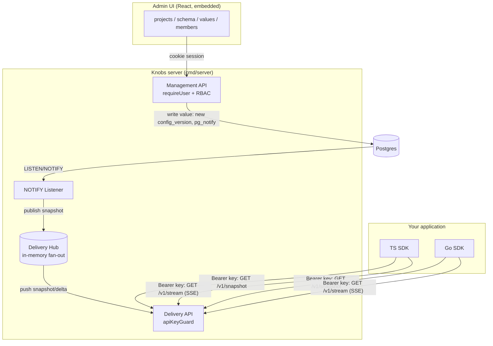

# Knobs — Architecture & Onboarding

This is the end-to-end design of Knobs and the doc to read first when joining the
codebase. It explains what each part does, how a config change travels from the
admin UI to a running app, and where to make changes. Pair it with the
[README](../README.md) (quick start + feature tour).

## 1. What Knobs is, in one model

Knobs is a **typed remote-configuration and feature-flag server**. The mental
model has four nouns:

- **Project** — a unit of config with one **schema** (the typed shape of the config).
- **Environment** — a named target within a project (e.g. `production`, `staging`)
  that holds the actual **values** for that schema.
- **Schema** — an ordered list of typed fields (`string`, `int`, `float`, `bool`,
  `enum`, `duration`, `json`) with constraints (min/max/pattern/enum). Values are
  validated against it.
- **Snapshot** — the read-model an SDK consumes: `{version, revision, schemaHash,
  values, targeting}` for one environment.

Two audiences, two APIs:

- **Humans** use the **management API** (session-cookie auth) via the embedded
  React admin UI: create projects, edit schemas, save values, manage members.
- **Machines** (your apps, through an SDK) use the **delivery API** (Bearer
  API-key auth): fetch the snapshot, hold an SSE stream open, receive pushes.

The delivery model is a **thick SDK**: the client holds the whole snapshot in
memory, so every config read is a local lookup, and a streamed push swaps the
in-memory snapshot atomically. No per-read network call.

## 2. High-level architecture

Everything runs in **one Go process** (a modular monolith) plus **one Postgres**.
The React UI is compiled to static assets and **embedded into the server binary**
(`web/embed.go`, `//go:embed all:dist`) — the server serves the API and the SPA.

## 3. The data model

Postgres, evolved through goose migrations in `internal/store/migrations/`
(`00001` … `00007`). Tables (key columns):

| Table | Purpose | Key columns |
|---|---|---|
| `organization` | tenant | `id`, `name`, `slug` unique |
| `organization_member` | user↔org role | `(organization_id, user_id)` PK, `role` CHECK(viewer/editor/admin/owner) |
| `app_user` | login identity | `id`, `email` (unique, lowercased), `password_hash` |
| `project` | config unit | `id`, `slug` unique, `organization_id` → org |
| `environment` | value target | `id`, `project_id`, `name` (unique per project), `current_version_id`, `delivery_revision` |
| `config_schema` | typed shape | `project_id` unique, `definition` jsonb, `schema_version` |
| `config_version` | one saved set of values | `(environment_id, version)` unique, `values` jsonb, `targeting` jsonb, `schema_version` |
| `api_key` | delivery credential | `environment_id`, `project_id`, `hash` unique, `scope` |
| `audit_log` | change trail | `project_id` (SET NULL on delete), `actor`, `action`, `target`, `diff` |

Relationships: an **org** has many **projects**; a project has one **schema** and
many **environments**; an environment points at its **current `config_version`**
(and keeps the history); values live *in* `config_version` alongside per-key
**targeting** rules. API keys are **environment-scoped** machine credentials,
independent of the user/RBAC model.

Two version-ish numbers, deliberately distinct — **this is the most important
invariant in the system**:

- **`version`** (`config_version.version`) — the user-facing config version. A
  rollback moves it *backwards* (it re-points `current_version_id` at an older row).
- **`delivery_revision`** (`environment.delivery_revision`) — a monotonic counter
  bumped on *every* change to `current_version_id`, including a rollback. It only
  ever increases.

SDKs dedupe, gate `?since=`, and order deltas on **`revision`, never `version`**,
so a rollback (higher revision, lower version) is delivered and applied
unambiguously.

## 4. Request lifecycles

### 4a. Saving values → live propagation

1. `PUT /v1/environments/{envID}/values` (`values_handlers.go:handlePutValues`).
2. Authorize: `authorizeEnv(envID, editor)` — 404 if the caller isn't a member of
   the env's org, 403 if their role is below `editor`.
3. In one transaction: take a `FOR UPDATE` lock on the project's `config_schema`
   row (`LockProjectSchema` — serializes schema-change vs value-write), compile the
   locked schema, validate the submitted `values` **and** `targeting` against it,
   insert a new `config_version` (next `version`), set it current (which bumps
   `delivery_revision`), write an audit row, and `SELECT pg_notify('knobs_env',
   '<envID>:<revision>')`.
4. On commit, Postgres delivers the NOTIFY. The `Listener`
   (`delivery/listener.go`, a dedicated raw `pgx.Connect`, *not* the pool) receives
   `<envID>:<revision>`, loads the fresh snapshot via a `SnapshotLoader`, and
   `Publish`es it to the `Hub`.
5. The `Hub` (`delivery/hub.go`) fans the snapshot out to every subscribed
   `/v1/stream` connection for that env. Each connection writes a frame to its
   client; the SDK applies it if `revision` advanced.

Validation failures return 422, a version-number race returns 409, all preserved
alongside the new 403/404 authz outcomes.

### 4b. Delivering snapshots & streams

- `GET /v1/snapshot` (`snapshot_handler.go`) — the current full snapshot.
- `GET /v1/stream` (`stream_handler.go`) — SSE. On connect it *subscribes to the
  Hub first*, then reads the current version (closing the subscribe-vs-read race),
  and sends the initial snapshot if `delivery_revision > since`. Then it forwards
  every `Hub` push as a `data: <json>\n\n` frame, with `: heartbeat` comments while
  idle. It returns on client disconnect or on the server's shutdown signal (so
  graceful shutdown doesn't hang on a live stream).
- **Deltas** (`?deltas=1`): when a client opts in, the handler tracks the last
  snapshot it sent on that connection and emits `{"type":"delta", from, revision,
  values:{set,remove}, targeting:{set,remove}}` instead of a full frame; the initial
  and fallback frames are `{"type":"snapshot", …}`. Without the param the wire is
  byte-for-byte the classic bare snapshot, so old SDKs are unaffected. Because a
  delta is a **state diff** (not an op-log) and the Hub always keeps the *latest*
  snapshot (drop-oldest on a slow subscriber), a dropped intermediate revision just
  widens the next delta — correctness holds. The SDK requires `from ==
  current.revision`; on mismatch it refetches a full snapshot.

The Hub is in-memory and per-process. Postgres `LISTEN/NOTIFY` is what makes it
work across multiple server instances: every instance's Listener hears the NOTIFY
and pushes to its own local subscribers.

### 4c. Targeting evaluation (3-implementation parity)

Targeting is evaluated **client-side** so reads stay local. The server ships the
*rules* in the snapshot; the SDK resolves them against a per-call `EvalContext`.

- `resolve(key, ctx)`: if the key has no rules → the base value; else the first
  rule whose conditions all match → its static value or a rollout bucket; no match
  → base value.
- Bucketing is deterministic: `sha256(salt + ":" + key + ":" + targetingKey)`, take
  the first 4 bytes big-endian as a uint32, divide by 2³², multiply by the total
  weight, walk the variants. Salt defaults to the key; an empty targeting key → the
  first variant.

There are **three** implementations of this algorithm — the reference in
`internal/targeting/eval.go`, `sdk/typescript/src/eval.ts`, and `sdk/go/eval.go`
(the Go SDK is a separate module and can't import the reference). They're kept in
lockstep by a single golden-vector file, `internal/targeting/testdata/vectors.json`,
**copied byte-for-byte** into each SDK's testdata; each suite asserts against it.
The vectors cover the divergence-prone corners (multi-variant, non-100 weight sums,
fractional weights, unicode keys, `notIn`-missing-attribute, numeric-op-on-
non-numeric). Rule *values* are also validated against the field schema at save
time (`internal/targeting/validate.go` + `schema.CompileField`).

### 4d. Authorization (multi-tenant RBAC)

Every management route resolves the target's **organization** and checks the
caller's **role** there. Roles form a total order: `viewer < editor < admin <
owner` (`internal/authz`). The check lives in `internal/api/authorize.go`:

- `authorizeOrg(userID, orgID, min)` — loads the caller's membership role; a
  non-member returns `store.ErrNotFound` → **404** (existence hidden, no tenant
  enumeration); a member below `min` returns `errForbidden` → **403**.
- `authorizeProject` / `authorizeEnv` — load the row, derive its org *from the
  loaded row* (never from caller input, so a cross-tenant id can't confuse the
  deputy), then `authorizeOrg`.

The role required per route (the guard map): reads = `viewer`; value writes /
rollback = `editor`; schema edits, environment creation, API-key create/revoke,
project create/rename = `admin`; member management = `owner`. `GET /v1/projects`
is *filtered* to the caller's orgs rather than 403-gated. `authz_matrix_test.go`
asserts, per route, that a non-member gets 404, a below-role member gets 403, and
an at/above member succeeds. An unknown role string ranks below `viewer` (no
accidental privilege). Guardrails: you can't grant a role above your own, and the
last `owner` of an org can't be demoted or removed (enforced with a `FOR UPDATE`
lock on the owner set to close a TOCTOU race).

New users without email infrastructure: an owner/admin **adds a member by email**;
if no `app_user` exists, one is created with a server-generated temporary password
(crypto/rand, hashed, returned once to the inviter, never logged).

### 4e. Rollback

`POST /v1/environments/{envID}/rollback` re-points `current_version_id` at an
earlier `config_version` and bumps `delivery_revision`. Because the historical row
carries its own `values` *and* `targeting`, the rollback restores both, and the
higher revision guarantees the SDKs apply it even though `version` went down.

## 5. Subsystem map (`internal/`)

| Package | Role |
|---|---|
| `app` | `Run(ctx)` — the composition root: load config → pool → migrate → seed admin → build Hub + Listener → HTTP server → graceful shutdown. |
| `config` | `Load()` — env vars (see README), enforces `JWT_SECRET ≥ 32`. |
| `api` | chi router, handlers, `requireUser`/`apiKeyGuard` middleware, `authorize.go`, login rate limiter, JSON helpers. |
| `authz` | pure role hierarchy (`Role`, `AtLeast`, `Valid`) — no HTTP/DB knowledge. |
| `auth` | JWT session issue/verify, password hashing, session cookie. |
| `store` | plain pgx repository (`Repo`, `DBTX`, `WithTx`, `RecordAudit`, `ErrNotFound`) + migrations. One file per aggregate. |
| `schema` | typed field definitions → JSON-Schema validator (`Compile`, `ValidateValues`, `CompileField`). |
| `targeting` | rule types, the reference evaluator + bucketing, and rule validation. |
| `delivery` | `Snapshot`/`BuildSnapshot`, `Hub` (fan-out), `Listener` (NOTIFY→Hub), `delta.go` (compute/apply). |
| `codegen` | schema → typed accessor source for TS and Go. |
| `apikey` | delivery-key generation + hashing. |

The web UI (`web/`) is a standard Vite/React app; `web/embed.go` bakes its built
`dist/` into the binary. `web/dist/` is a release-time artifact — only
`dist/index.html` is tracked; the JS/CSS bundle is regenerated by `make build-web`.

## 6. The SDKs

Both SDKs implement the same thick-SDK lifecycle:

1. `Ready()`/`ready()` — fetch the first snapshot (`GET /v1/snapshot`), store it,
   then start background work: an SSE stream (reconnect with backoff) and a
   slow-poll fallback, all funnelled through one **revision-gated `applySnapshot`**
   (`if incoming.revision <= current.revision: ignore`).
2. Reads — `get`/`Get` return base values; `get(key, ctx)`/`GetFor` and
   `evaluate`/`EvaluateAll` resolve targeting. `getAll`/`GetAll` are base-only.
3. `onChange`/`OnChange` — notified after each applied snapshot.
4. Delta frames — parsed by `type`; a `snapshot` (or a typeless bare frame, for an
   old server) replaces wholesale; a `delta` is merged onto the current snapshot
   when `from` matches, else triggers a full-snapshot resync.

The **Go SDK** (`sdk/go`) is a **separate stdlib-only module** (`github.com/
Rohan-Muslekar/knobs/sdk/go`, its own `go.mod`, no third-party deps) so consumers
don't inherit the server's dependency tree. Its evaluator and delta logic are
reimplemented from the reference and pinned by the shared golden vectors.

## 7. Codegen (`knobs gen`)

`cmd/knobs gen` GETs `/v1/schema` (Bearer), decodes `{definition, schemaHash}`,
and emits a typed `Config` plus a `Typed(client)` helper and a `SchemaHash`
constant (`internal/codegen/{ts,go}.go`). Type mapping (Go): string/duration →
`string`, int → `int64`, float → `float64`, bool → `bool`, enum → `string` (+ a
doc comment of allowed values), json → `any`. The emitter is injection-safe
(descriptions are neutralized, identifiers are derived/quoted) and errors on a
derived-identifier collision rather than emitting uncompilable code.

## 8. Startup, deployment, ops

`cmd/server/main.go` is a one-liner into `app.Run`. Startup order:
`config.Load` → pgx pool → **run migrations** (goose, embedded) → build repo +
auth → **seed admin** (only when the users table is empty; makes the admin the
`default` org's owner) → Hub + Listener goroutine → HTTP server → graceful
shutdown (signal the stream handlers, `srv.Shutdown` with a 15s timeout, then cancel
the Listener).

Deploy as a single binary + a Postgres. Run multiple instances behind a load
balancer for HA — cross-instance propagation is handled by `LISTEN/NOTIFY`, and
the login rate limiter is per-instance (documented; a shared store is future work).
Set `COOKIE_SECURE=true` (default) behind TLS and `TRUST_PROXY=true` behind a
trusted proxy.

## 9. Testing

- **Unit** (`make test` / `go test ./...`) — no database; the default suite stays
  DB-free and green.
- **Integration** (`make test-integration` / `-tags=integration`) — Testcontainers
  spins up real Postgres. Migrations, store round-trips, the SSE stream, and the
  RBAC matrix (`authz_matrix_test.go`, `authorize_test.go`, `concurrency_test.go`)
  live here.
- **Go tests run with `-race`.** SDKs have their own suites (Go SDK `go test -race
  ./...`; TS SDK + web `npm test` via vitest), including golden-vector parity tests
  and fake-server lifecycle e2e.

## 10. Extending it — where things go

- **A new field type** → `internal/schema` (validator mapping) + `internal/codegen`
  (both emitters) + the SDK/UI input coercion.
- **A new management endpoint** → a handler in `internal/api`, a route in
  `router.go` *with an `authorize*` call*, a store method, and a matrix-test row.
  (Authorization is a hard requirement — an unguarded management route is a bug.)
- **A new snapshot field** → `delivery.Snapshot` (+ `omitempty` for wire compat),
  `BuildSnapshot`, the `config_version` column + migration, and both SDK snapshot
  types + the delta set/remove handling.
- **Anything touching cross-SDK evaluation** → change the reference in
  `internal/targeting`, regenerate `vectors.json`, copy it byte-identical into both
  SDK testdata, and confirm all three suites pass. The shared vectors are the
  contract.

## 11. Invariants & gotchas (keep these in mind)

- **Dedup on `revision`, never `version`.** A rollback carries a higher revision and
  a lower version and must apply.
- **The delivery payload is a contract.** `Snapshot` JSON tags, `omitempty`
  behavior, and the delta shape are consumed by three implementations — change them
  in lockstep.
- **`vectors.json` must be byte-identical** in all three locations. Reviews diff them.
- **Every management route must authorize** and hide cross-tenant existence (404 for
  non-members, not 403).
- **The Listener uses a dedicated connection**, not the pool — `LISTEN` needs a
  long-lived connection.
- **Migrations run before the seed**; a migration that backfills (like `00007`
  assigning a `default` org) must be self-contained and reversible.
